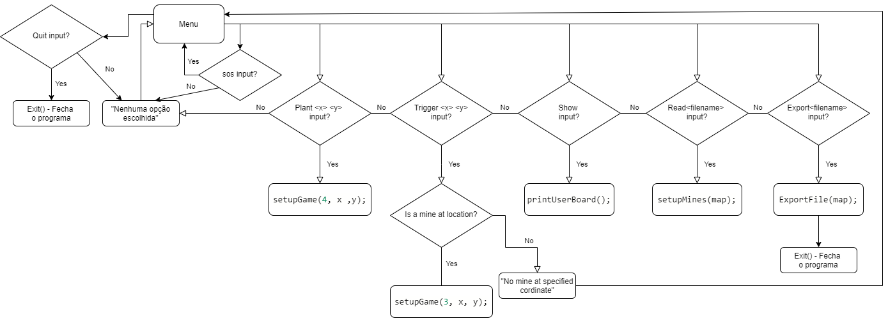
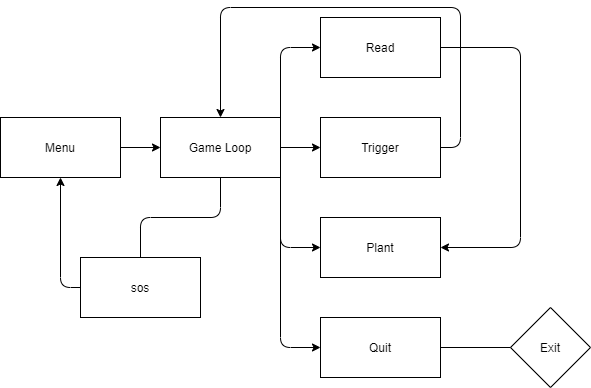

# MiniProjeto - ***Introdução á computação***
### Descrição do projeto :
**Fluxograma**





## Método utilizado para teste e debug
-   Utilizei maioritariamente o Repl.it para teste e debug do projecto mas também utilizei o Visual Studio Code com software de auxílio.


## Conclusões e matéria aprendida
-   Para desenvolver um programa capaz de ler um ficheiro de configuração contendo o mapa com a localização de uma série de minas aprendi **Manipulação de ficheiros, Vectores, Matrizes e Strings** de forma a fornecer ao utilizador uma interface para fazer alterações ao mapa - adicionar novas minas ou rebentar uma mina existente, aprendi também a forma correta utilizar de **Ciclos e Condições**.
- A solução foi feita tentando sempre que possível respeitar os princípios da linguagem de programação C.
- O projeto foi organizado de forma a que seja fácil a sua compreensão e trabalho.

- **`Manipulação de ficheiros`**
- Para leitura de um ficheiro utilizei a função `fopen()` como se pode verificar no **exemplo** abaixo. 
```
FILE* f;
f = fopen(map, "r");
	if (f == NULL)
		{
		fprintf(stderr, "Error opening file\n");
		return;
		}
	char chr;
	int count = 0;
	// Estrai caracteres do ficheiro e gurada-os no caracter c
	for (chr = getc(f); chr != EOF; chr = getc(f)) 
		{
	if (chr == '\n'){ // Incrementa count se o caracter estiver numa nova linha
	count = count + 1;
		}
	}
	fclose(f);
```
- **`Vectores`**

```
for (column = 0; column < BOARD_SIZE; column++) 
{ 
   for (row = 0; row < BOARD_SIZE; row++) 
   { 
     printf(" %c ", board[column][row]); 
   } 
   if (column >= 0 && column <= BOARD_SIZE) 
   printf(" %d", column); printf("\n"); 
}
```

- **`Ciclos e Condições`**
```
// Ciclo principal para correr o Programa.
while (exit == false) 
{ 
  do 
   { 
     printf("\nEnter the row: ");
     scanf("%d", &xpos);
     printf("Enter the column: ");
     scanf("%d", &ypos);
     printf("\n"); 
   }while ((xpos < 0 xpos > BOARD_SIZE - 1 ypos < 0 || ypos > BOARD_SIZE - 1));
   
   if (board[xpos][ypos] == 'M' && num == 3) 
   { 
     printf("You explode mine (%d, %d)!\n\n", xpos, ypos);
     ExploteMine(xpos, ypos);
     exit = true; //loss(); 
   } 
   else if (board[xpos][ypos] != 'M' && num == 4) 
   { 
     printf("You put a new mine in (%d, %d)!\n\n", xpos, ypos);
     ExploteMine(xpos, ypos);
     exit = true; 
   }
     printUserBoard(); 
   }
```


## Referências

 Utilizei como referência as **vídeo aulas** do professor assim com os **slides** das mesmas e também usei como referências os seguintes **websites** :
- https://c.happycodings.com/pointers/
- https://www.programiz.com/c-programming
- https://www.tutorialspoint.com/cprogramming/index.htm
- https://www.geeksforgeeks.org/c-language-set-1-introduction/
